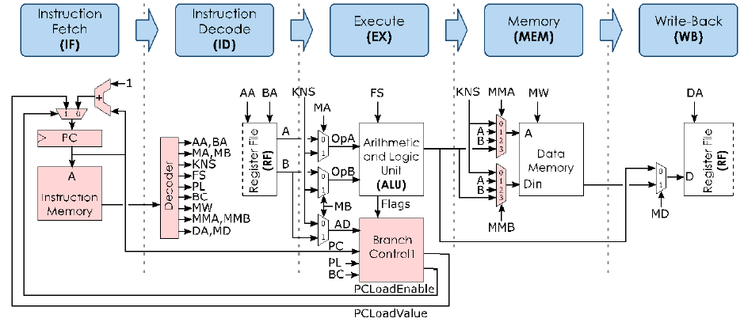

# Pipelined RISC processor in VHDL

This project was developed for the Advanced Computer Architectures course. It aims to design a 5-stage pipelined 32-bit RISC processor with 32-bit instructions and 16 general-purpose 32-bit registers (with register R0 always stuck at zero).

## Diagram 

The five stages are:

**IF(Instruction Fetch):** reads instruction memory and updates Program Counter.

**ID(Instruction Decode):** decodes instruction and fetchs operands.

**EX(Execute):** execution of the instruction.

**MEM(Memory):** read/write data from/to memory.

**WB(Write-Back):** writes result to Register File.

