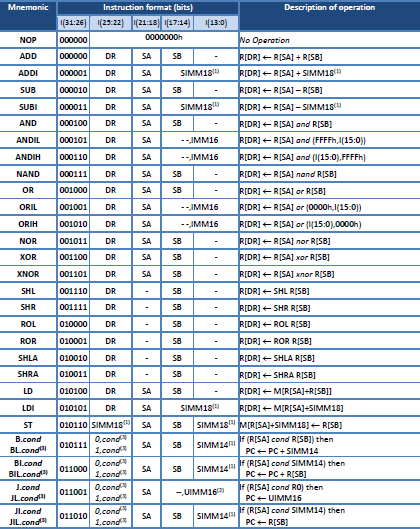
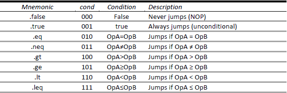

# Pipelined RISC processor in VHDL

This project was developed for the Advanced Computer Architectures course. It aims to design a 5-stage pipelined 32-bit RISC processor with 32-bit instructions and 16 general-purpose 32-bit registers (with register R0 always stuck at zero).

## Diagram 

The five stages are:

**IF(Instruction Fetch):** reads instruction memory and updates Program Counter.

**ID(Instruction Decode):** decodes instruction and fetchs operands.

**EX(Execute):** execution of the instruction.

**MEM(Memory):** read/write data from/to memory.

**WB(Write-Back):** writes result to Register File.

## Instruction set architecture (ISA)

## Structure
In the src folder, there are two top modules (and in the testbench folder, there is one testbench for each top module): SingleCycle.vhd (non-pipelined processor where each instruction is completed in a single clock cycle) and FiveStagePipeline.vhd (pipelined processor where max 5 instructions are executed simultaneously in different stages). Although the pipelined is obviously faster (increases clock frequency and system throughput), there are data and control hazards that need to be solved. For that end, some techniques were applied such as data forwarding (for data hazards) and predict branch not taken (for control hazards).